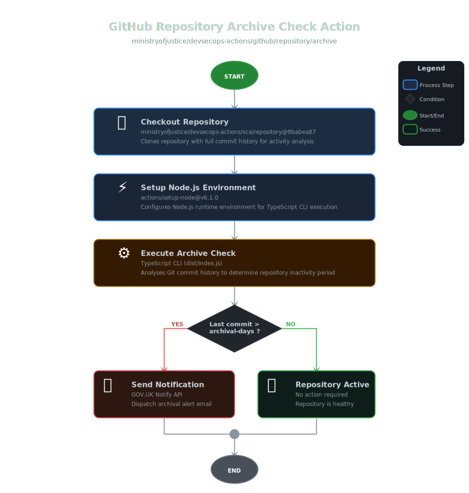

# 🔎 Repository Archive Check Action

Automated Repository Health Monitoring

---

[](../../../LICENSE)
[](https://www.gov.uk/government/organisations/ministry-of-justice)

## Overview

Automated repository health monitoring action that scans GitHub repository commit history to identify dormant repositories eligible for archival.
This action analyses repository activity patterns and dispatches notifications when repositories have been inactive for a specified period.

**Key Capabilities:**

- **Repository Archive Detection** - Automated dormant repository identification
- **Lifecycle Management** - Intelligent repository archival workflows
- **Compliance Notifications** - Email alerting via GOV.UK Notify
- **Activity Monitoring** - Commit history analysis and reporting
- **Automated Governance** - Proactive repository health management

---

## 📋 Table of Contents

- [Architecture](#️-architecture)
- [Features](#-features)
- [Usage Examples](#-usage-examples)
- [Inputs](#-inputs)
- [Required Permissions](#-required-permissions)
- [Configuration](#️-configuration)
- [Best Practices](#-best-practices)
- [Contributing](#-contributing)
- [License](#-license)
- [Support](#-support)

---

## 🏗️ Architecture

### Component Workflow



This action performs automated dormant repository detection:

1. **🔎 Archive Check** - Identifies repositories eligible for archival based on inactivity

### Design Principles

- **Automated Detection** - Proactive identification of inactive repositories
- **Configurable Thresholds** - Customisable inactivity periods
- **Notification Integration** - Seamless GOV.UK Notify email alerts
- **Non-Intrusive** - Read-only repository analysis
- **Audit Trail** - Complete logging of all actions

---

## ✨ Features

## ✨ Features

This action helps organisations:

- 📊 Maintain clean repository portfolios
- 🔒 Improve security posture by reducing attack surface
- 💰 Optimise GitHub license usage
- 📧 Automate governance workflows
- ✅ Ensure compliance with retention policies

**Capabilities:**

- ✅ **Configurable Inactivity Period** - Define custom archival thresholds
- ✅ **Email Notifications** - GOV.UK Notify integration for alerts
- ✅ **Commit History Analysis** - Deep scanning of repository activity
- ✅ **Zero Configuration** - Works with sensible defaults
- ✅ **Non-Destructive** - Analysis only, no automatic archival

### Technical Details

**Components:**

1. **📦 Repository Checkout** - Secure code retrieval
2. **⚡️ Node.js Setup** - Runtime environment preparation
3. **💾 Dependency Installation** - Required package installation
4. **⚙️ Archive Scanner** - Commit history analysis engine

**Supported Scenarios:**

- ✅ Organisation-wide repository audits
- ✅ Scheduled repository health checks
- ✅ Compliance reporting workflows
- ✅ License optimisation initiatives

---

## 📖 Usage Examples

### Quick Start - Basic Archive Check

The simplest way to monitor repository activity:

#### Minimal Configuration

```yaml
name: Repository Archive Check
run-name: Archive Check 🔎

on:
  schedule:
    - cron: "0 0 1 * *" # Monthly on 1st at midnight UTC
  workflow_dispatch: # Manual trigger

permissions: {}

jobs:
  archive-check:
    name: Check Repository Activity
    runs-on: ubuntu-latest
    timeout-minutes: 10

    permissions:
      contents: read

    steps:
      - name: Archive Check
        uses: ministryofjustice/devsecops-actions/github/repository/archive@v1.3.0
        with:
          token: ${{ secrets.GITHUB_TOKEN }}
          notification-email: "team@example.gov.uk"
          gov-notify-key: ${{ secrets.GOV_NOTIFY_API_KEY }}
          gov-notify-template-id: ${{ secrets.GOV_NOTIFY_TEMPLATE_ID }}
```

**This provides:**

- ✅ Monthly repository activity checks
- ✅ 90-day default inactivity threshold
- ✅ Email notifications via GOV.UK Notify
- ✅ Complete activity logging

### Production Configuration - Custom Thresholds

Advanced configuration with customised inactivity periods:

```yaml
name: Repository Archive Check
run-name: Archive Check 🔎

on:
  schedule:
    - cron: "0 2 1,15 * *" # Bi-monthly at 2 AM UTC
  workflow_dispatch:
    inputs:
      archival-days:
        description: "Days of inactivity before alert"
        required: false
        default: "180"

permissions: {}

jobs:
  archive-check:
    name: Check Repository Activity
    runs-on: ubuntu-latest
    timeout-minutes: 15

    permissions:
      contents: read

    steps:
      - name: Archive Check with Custom Threshold
        uses: ministryofjustice/devsecops-actions/github/repository/archive@v1.3.0
        with:
          token: ${{ secrets.GITHUB_TOKEN }}
          archival-days: ${{ github.event.inputs.archival-days || '180' }}
          notification-email: "governance@example.gov.uk"
          gov-notify-key: ${{ secrets.GOV_NOTIFY_API_KEY }}
          gov-notify-template-id: ${{ secrets.GOV_NOTIFY_TEMPLATE_ID }}
          node-version: "24.11.1"
```

### Organisation-Wide Archive Monitoring

For organisations managing multiple repositories:

```yaml
name: Organisation Archive Audit
run-name: Org-Wide Archive Check 🔎

on:
  schedule:
    - cron: "0 3 1 */3 *" # Quarterly at 3 AM UTC
  workflow_dispatch:

permissions: {}

jobs:
  archive-audit:
    name: Audit Repository Activity
    runs-on: ubuntu-latest
    timeout-minutes: 20
    strategy:
      fail-fast: false
      matrix:
        archival-threshold:
          - days: 60
            email: "critical-team@example.gov.uk"
          - days: 90
            email: "standard-team@example.gov.uk"
          - days: 180
            email: "low-priority-team@example.gov.uk"

    permissions:
      contents: read

    steps:
      - name: Archive Check (${{ matrix.archival-threshold.days }} days)
        uses: ministryofjustice/devsecops-actions/github/repository/archive@v1.3.0
        with:
          token: ${{ secrets.GITHUB_TOKEN }}
          archival-days: ${{ matrix.archival-threshold.days }}
          notification-email: ${{ matrix.archival-threshold.email }}
          gov-notify-key: ${{ secrets.GOV_NOTIFY_API_KEY }}
          gov-notify-template-id: ${{ secrets.GOV_NOTIFY_TEMPLATE_ID }}
```

### Weekly Monitoring with Slack Integration

Combine with Slack notifications for team visibility:

```yaml
name: Weekly Archive Check
run-name: Weekly Archive Check 🔎

on:
  schedule:
    - cron: "0 9 * * 1" # Every Monday at 9 AM UTC
  workflow_dispatch:

permissions: {}

jobs:
  archive-check:
    name: Weekly Repository Check
    runs-on: ubuntu-latest
    timeout-minutes: 10

    permissions:
      contents: read

    steps:
      - name: Archive Check
        id: archive
        uses: ministryofjustice/devsecops-actions/github/repository/archive@v1.3.0
        with:
          token: ${{ secrets.GITHUB_TOKEN }}
          archival-days: "90"
          notification-email: "devops@example.gov.uk"
          gov-notify-key: ${{ secrets.GOV_NOTIFY_API_KEY }}
          gov-notify-template-id: ${{ secrets.GOV_NOTIFY_TEMPLATE_ID }}

      - name: Notify Slack
        if: always()
        uses: slackapi/slack-github-action@v2.0.0
        with:
          webhook-url: ${{ secrets.SLACK_WEBHOOK_URL }}
          payload: |
            {
              "text": "Archive check completed for ${{ github.repository }}"
            }
```

---

## 🔧 Inputs

All inputs are clearly defined with sensible defaults for ease of use.

### Repository Archive Check Inputs

| Input                     | Type   | Required | Default     | Description                                                                                                           |
| ------------------------- | ------ | -------- | ----------- | --------------------------------------------------------------------------------------------------------------------- |
| `token`                   | string | **Yes**  | N/A         | GitHub token with read permissions to repository contents                                                             |
| `archival-days`           | string | No       | `90`        | Number of non-activity days before repository is considered eligible for archival                                     |
| `notification-email`      | string | **Yes**  | N/A         | Email address to receive notifications for repositories dormant for specified archival-days period                    |
| `gov-notify-key`          | string | **Yes**  | N/A         | GOV.UK Notify API key for sending email notifications                                                                 |
| `gov-notify-template-id`  | string | **Yes**  | N/A         | GOV.UK Notify template ID for notification email format                                                               |
| `node-version`            | string | No       | `24.11.1`   | Node.js version to use for executing the archive check scanner                                                        |

---

## 🔐 Required Permissions

Your workflow must explicitly grant these permissions:

| Permission        | Level     | Purpose                                              |
| ----------------- | --------- | ---------------------------------------------------- |
| `contents`        | **read**  | Repository checkout and commit history access        |

**Example:**

```yaml
permissions:
  contents: read
```

**Note**: This action is read-only and does not require write permissions. It performs analysis and sends notifications but does not modify repository content.

---

## ⚙️ Configuration

### GOV.UK Notify Setup

#### 1. Create GOV.UK Notify Account

1. Sign up at [GOV.UK Notify](https://www.notifications.service.gov.uk/)
2. Create a new service for your organisation
3. Navigate to "API integration" section

#### 2. Generate API Key

1. Click "API keys" in the service dashboard
2. Create a new API key with appropriate name
3. Select key type (team/test/live)
4. Copy the generated API key securely

#### 3. Create Email Template

Create an email template with placeholders:

**Template Example:**

```text
Subject: Repository Archival Alert

Dear Team,

The repository ((name)) has been dormant for ((date)) days and is now eligible for archival.

Repository: ((name))
Last Activity: ((date))

Best regards,
DevSecOps Team
```

**Template Variables:**

- `name` - Repository name
- `date` - Last commit date

#### 4. Store Secrets in GitHub

Add these secrets to your GitHub repository:

1. **GOV_NOTIFY_API_KEY**
   - Value: Your GOV.UK Notify API key
   - Format: `key-name-xxxxxxxx-xxxx-xxxx-xxxx-xxxxxxxxxxxx-xxxxxxxx-xxxx-xxxx-xxxx-xxxxxxxxxxxx`

2. **GOV_NOTIFY_TEMPLATE_ID**
   - Value: Template ID from GOV.UK Notify
   - Format: `xxxxxxxx-xxxx-xxxx-xxxx-xxxxxxxxxxxx`

### Customising Archival Thresholds

Different thresholds for different repository types:

```yaml
# Critical repositories - 180 days
archival-days: "180"

# Standard repositories - 90 days (default)
archival-days: "90"

# Experimental repositories - 30 days
archival-days: "30"

# Compliance requirements - 365 days
archival-days: "365"
```

### Email Notification Best Practices

**Recipient Guidelines:**

- ✅ Use team distribution lists
- ✅ Include SRE / Cyber teams
- ✅ Use monitored mailboxes
- ❌ Avoid personal email addresses

**Template Best Practices:**

- ✅ Clear subject lines
- ✅ Actionable instructions
- ✅ Contact information
- ✅ Relevant links
- ✅ Compliance context

---

## 📚 Best Practices

### Versioning Strategy

```yaml
# ✅ Recommended: Commit SHA (maximum stability)
uses: ministryofjustice/devsecops-actions/github/repository/archive@9babea875cafae0e3b05a5ec5aca76d6b560c42e

# ⚠️ Not recommended: Branch names
uses: ministryofjustice/devsecops-actions/github/repository/archive@v1.3.0
```

### Scheduling Best Practices

```yaml
# ✅ Monthly checks (recommended for most organisations)
schedule:
  - cron: "0 0 1 * *" # 1st of each month

# ✅ Quarterly checks (for large portfolios)
schedule:
  - cron: "0 0 1 */3 *" # Every 3 months

# ✅ Weekly checks (for active governance)
schedule:
  - cron: "0 9 * * 1" # Every Monday

# ⚠️ Daily checks (usually too frequent)
schedule:
  - cron: "0 0 * * *" # May generate alert fatigue
```

### Security Best Practices

```yaml
# ✅ Use GitHub's built-in token
token: ${{ secrets.GITHUB_TOKEN }}

# ❌ Never hardcode credentials
gov-notify-key: key-abc123... # NEVER DO THIS

# ✅ Store all sensitive data in secrets
gov-notify-key: ${{ secrets.GOV_NOTIFY_API_KEY }}

# ✅ Use organisation-level secrets for shared services
gov-notify-template-id: ${{ secrets.ORG_NOTIFY_TEMPLATE_ID }}
```

### Threshold Selection Guidelines

| Repository Type           | Recommended Threshold | Rationale                            |
| ------------------------- | --------------------- | ------------------------------------ |
| Production Services       | 180-365 days          | Long release cycles expected         |
| Development Projects      | 90 days               | Regular activity expected            |
| Experimental Repositories | 30-60 days            | Short-lived by nature                |
| Documentation             | 180 days              | Updated less frequently              |
| Archived Projects         | N/A                   | Should already be archived           |

### Notification Management

**Escalation Strategy:**

```yaml
# Stage 1: 60-day warning
archival-days: "60"
notification-email: "team-leads@example.gov.uk"

# Stage 2: 90-day alert
archival-days: "90"
notification-email: "sre@example.gov.uk"

# Stage 3: 120-day final notice
archival-days: "120"
notification-email: "cyber@example.gov.uk"
```

---

## 🤝 Contributing

We welcome contributions! See the main repository [Contributing Guidelines](../README.md#-contributing) for details.

### Development Workflow

1. Fork the repository
2. Create a feature branch
3. Make your changes to `github/` actions
4. Test with a sample repository
5. Update this README if adding features
6. Submit a pull request

---

## 📄 License

This project is licensed under the **MIT License** - see the [LICENSE](../../LICENSE) file for full details.

---

## 📞 Support

### Getting Help

- **📖 Documentation**: This README and inline action documentation
- **🐛 Bug Reports**: [GitHub Issues](https://github.com/ministryofjustice/devsecops-actions/issues)
- **✨ Feature Requests**: [GitHub Issues](https://github.com/ministryofjustice/devsecops-actions/issues)
- **🔒 Security Issues**: See [Security Policy](https://github.com/ministryofjustice/devsecops-actions?tab=security-ov-file)

### Response Times

- **Critical Issues**: Within 24 hours
- **Bugs**: Within 3-5 business days
- **Feature Requests**: Within 1-2 weeks

---

## 🏆 Acknowledgments

This action integrates with:

- **GOV.UK Notify** - Government digital notification service
- **GitHub API** - Repository management and analysis
- **Node.js** - Runtime environment

---

## 🔗 Related Documentation

- [GOV.UK Notify Documentation](https://docs.notifications.service.gov.uk/)
- [GitHub Actions Documentation](https://docs.github.com/en/actions)
- [Main Repository README](../README.md)

---

Made with ❤️ by the Ministry of Justice UK - OCTO Cyber
